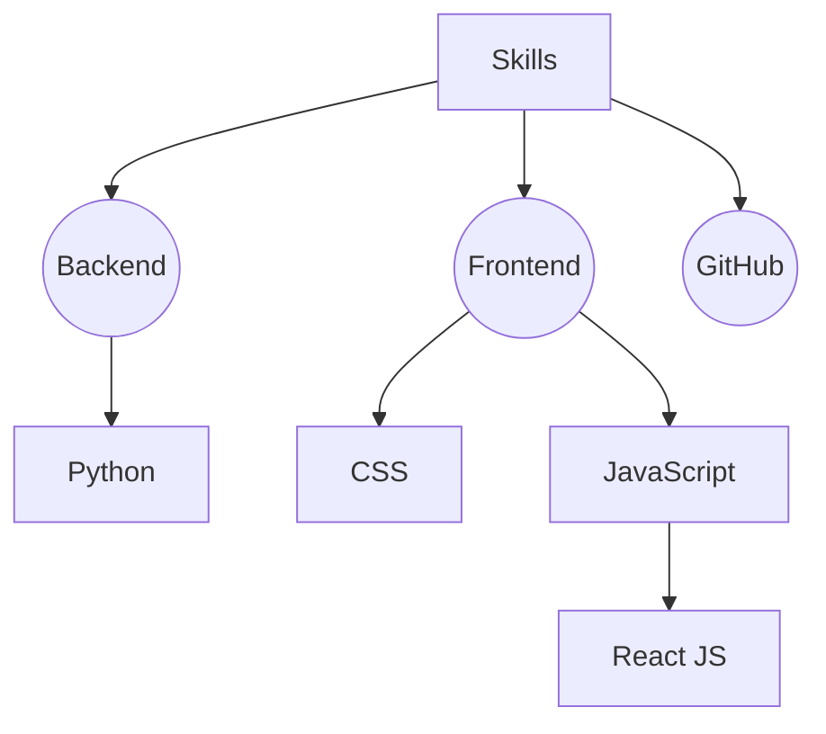

# Ефанов Сергей


## Контактная информация

- **Адрес:** Россия, г. Москва
- **E-mail:** super.sirigo@yandex.ru
- **GitHub:** [sergey-efanov](https://github.com/sergey-efanov)

## О себе

Привет! Меня зовут Сергей, я начинающий фронтенд-разработчик. Освоил основы HTML, CSS и JavaScript, люблю писать чистый и понятный код. Вдохновляет идея создавать то, что будет удобно людям и приносить им удовольствие, а ещё мне нравится автоматизировать рутинные задачи с помощью кода. Всегда открыт новым знаниям!

## Навыки



## Пример кода

```javascript
let players = userInput();
let result = 0;

function Game(players) {
  this.players = players;

  this.calculateTotalDamage = function () {
    return this.players.reduce((acc, player) => (acc += player.damage), 0);
  };
}

let pubg = new Game(players);
result = pubg.calculateTotalDamage();
```
